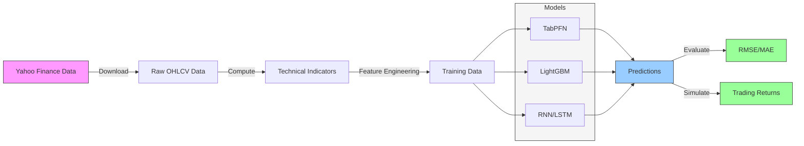
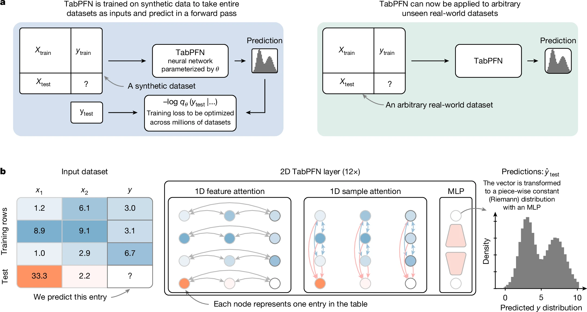

# **Stock Price Prediction with TabPFN**

## 1. Overview
This repository applies the [TabPFN (Tabular Prior-data Fitted Network)](https://github.com/automl/TabPFN) model to **next-day stock price prediction**. TabPFN uses two-way 1D attention (across features and samples) and is pre-trained on millions of synthetic tabular datasets. We compare its performance with:
- **LightGBM** (a strong tree-based baseline)
- **Simple RNN/LSTM** (a common deep-learning baseline for time-series)

We aim to show how TabPFN can be directly used on stock data retrieved from [Yahoo Finance](https://pypi.org/project/yfinance/) and how it performs in both **forecast accuracy** and a **basic trading strategy**.

---

## 2. Statement of Problem
**Goal**: Predict the next-day closing price (or price return) of a chosen stock or ETF.  
**Why**:  
- Accurate short-term predictions can aid in decision-making for traders, analysts, or automated systems.  
- Traditional methods (like tree-based models) can work well on tabular data, but we want to see if TabPFN's attention-based approach can match or outperform them in terms of speed and accuracy on small-to-medium datasets.

---

## 3. Data Sources & Description
- **Yahoo Finance** via the `yfinance` library
- Typical features: Date, Open, High, Low, Close, Volume
- Engineered features: Moving Averages, RSI, MACD, or any additional technical indicators
- Each row corresponds to one trading day. We create a shifted "next-day" target column to predict future prices.

---

## 4. Approach
1. **Data Collection**: Pull historical data (e.g., 2010–2023) for a specific ticker like `SPY`, clean and store in a Pandas DataFrame.  
2. **Feature Engineering**: Compute rolling averages, RSI, or other indicators.  
3. **Model Training**  
   - **LightGBM**: Classic gradient boosting baseline  
   - **RNN**: Simple Keras/TensorFlow model for time-series  
   - **TabPFN**: Directly consumes tabular rows and outputs next-day predictions  
4. **Evaluation**  
   - **RMSE, MAE, or R²** on a time-based split (train/validation/test)  
   - **Trading Strategy**: If predicted return is positive, simulate a "long" position; otherwise remain in cash (or short). Measure total returns.  
5. **Comparison**: Which model yields the best numeric forecasts and/or trading performance?

---

## **Diagram: End-to-End Flow**

## Diagram: TabPFN's Two-Way Attention Mechanism

---

## 5. Timeline & Deliverables
### Timeline
- Data Gathering & Feature Engineering
- Initial Model Training
- Comparison & Validation
- Backtesting & Strategy Analysis
- Final Report

### Deliverables
- **Data**: Cleaned CSV or Parquet files with indicators
- **Notebooks**:
  - Data exploration
  - Model training scripts
  - Backtesting
- **Results**: Plots, metrics (RMSE, directional accuracy, cumulative returns)

---

## 6. Resources
### Software
- Python 3
- yfinance
- tabpfn
- lightgbm
- tensorflow/torch for RNNs

### Hardware
- Google Colab or a local machine with a GPU for faster training

### Documentation
- [TabPFN GitHub](https://github.com/automl/TabPFN)
- [LightGBM Docs](https://lightgbm.readthedocs.io/)
- [Keras Documentation](https://keras.io/api/)

---

## 7. Stakeholders
- **Data Scientists/Quants**: Interested in leveraging new ML approaches for market forecasts
- **Traders/Portfolio Managers**: May integrate these predictions into strategies
- **Academics/Researchers**: Can extend the approach to other tabular/time-series data

---

## 8. Contact Information
- **Maintainer**: Shivam Tyagi (st.shivamtyagi.01@gmail.com)
- **Contributors**: Feel free to submit PRs/issues on GitHub or email the maintainer

---

## 9. License
Distributed under the Apache 2.0 License. See `LICENSE` file for more information.

---

## 10. How to Contribute
1. Fork this repository
2. Create a new branch for your feature/fix
3. Commit your changes with clear messages
4. Open a Pull Request describing your changes

We welcome improvements to:
- Data pipelines
- Feature engineering steps  
- Model training scripts
- Documentation and tutorials
